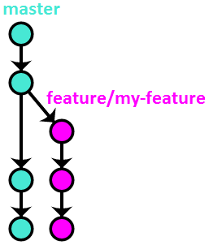
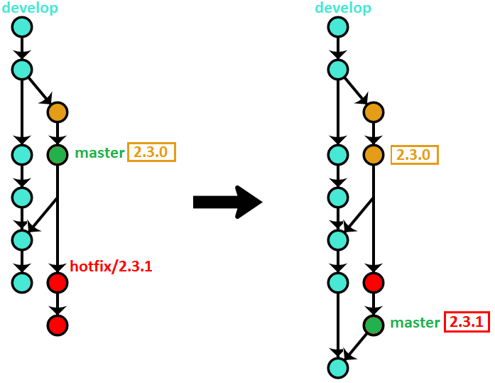

[原文](https://www.endoflineblog.com/oneflow-a-git-branching-model-and-workflow)

# OneFlow – a Git branching model and workflow

Posted on 2017-04-30

この投稿では、私のサイドプロジェクトと仕事の両方で長年成功を収めてきた Git のブランチモデルについて説明します。私はそれを OneFlow と呼びます。

このワークフローは、2015年5月に [GitFlow considered harmful](https://www.endoflineblog.com//gitflow-considered-harmful) の記事で最初に説明しています。
上記投稿のコメントで、このブランチモデルの詳細な説明を求めるリクエストが多く、また、 OneFlow という名前は読者から提案されました（多くの候補から選びました）。
この記事は、包括的かつ詳細なリファレンスとなることを意図していますが、コアのブランチモデルは、上記投稿で説明されているものとまったく同じです。

## Table of Contents

- [Introduction](#introduction)
  - [OneFlow advantages](#oneflow-advantages)
  - [When to use OneFlow](#when-to-use-oneflow)
  - [When NOT to use OneFlow](#when-not-to-use-oneflow)
- [Detailed description](#detailed-description)
  - [The main branch](#the-main-branch)
  - [Feature branches](#feature-branches)
    - [Starting a feature branch](#starting-a-feature-branch)
    - [Finishing a feature branch](#finishing-a-feature-branch)
  - [Release branches](#release-branches)
    - [Starting a release branch](#starting-a-release-branch)
    - [Finishing a release branch](#finishing-a-release-branch)
  - [Hotfix branches](#hotfix-branches)
    - [Starting a hotfix branch](#starting-a-hotfix-branch)
    - [Finishing a hotfix branch](#finishing-a-hotfix-branch)
- [Variation – develop + master](#variation-develop-master)
  - [The main branches](#the-main-branches)
  - [Feature branches](#develop-feature-branches)
    - [Starting a feature branch](#develop-starting-a-feature-branch)
    - [Finishing a feature branch](#develop-finishing-a-feature-branch)
  - [Release branches](#develop-release-branches)
    - [Starting a release branch](#develop-starting-a-release-branch)
    - [Finishing a release branch](#develop-finishing-a-release-branch)
  - [Hotfix branches](#develop-hotfix-branches)
    - [Starting a hotfix branch](#develop-starting-a-hotfix-branch)
    - [Finishing a hotfix branch](#develop-finishing-a-hotfix-branch)

## Introduction

OneFlow は、 [GitFlow](http://nvie.com/posts/a-successful-git-branching-model/) のよりシンプルな代替手段として考えられています。ただし、「シンプル」を「劣っている(less able)」と解釈しないでください。 OneFlow のブランチモデルは、 GitFlow とまったく同じくらい強力です。
There is not a single thing that can be done using GitFlow that can’t be achieved (in a simpler way) with OneFlow. The description below goes into more detail.

名前が示すように、 OneFlow の基本的な前提として、リポジトリに対して1つの永続的なブランチがあることです。これにより、ブランチモデルの表現力を失うことなく、多くの利点がもたらされます。 Git のタグの使用により、より高度なユースケースが実現可能になります。

ワークフローは永続的 (long-lived) なブランチを1つ持つことを提唱していますが、それを使用するときに他のブランチが関与していないという意味ではありません。逆に、このブランチモデルでは、さまざまなサポートブランチの使用を推奨しています（詳細については、以下を参照してください）。
ただし、重要なのはそれらが短命であることを意図しており、その主な目的は、コードの共有を容易にし、バックアップとして機能することです。履歴は常に1つの永続的 (long-lived) なブランチに基づいています。

### OneFlow advantages

永続的 (long-lived) なブランチを1つ維持することで、開発者が実行しなければならないバージョン管理スキームと操作が大幅に簡素化されます。

また、プロジェクトの履歴がすっきりと読みやすくなり、より便利になります。

### When to use OneFlow

OneFlow は、 GitFlow の完全互換 (a drop-in replacement) となることを目的としています。つまり、 GitFlow が存在するすべての状況に適しています。実際、 GitFlow を使用しているプロジェクトを OneFlow に非常に簡単に移行できます。

プロジェクトで OneFlow を使用するために満たす必要がある主な条件は、すべての新しい本番リリースが以前のリリースに基づいていることです (GitFlow の要件はまったく同じです) 。
だいたいのソフトウェアプロジェクトは、その条件を満たしています。たとえば、プロジェクトが Web アプリケーションの場合、 OneFlow が最適です。また、ほとんどのオープンソースプロジェクトは、 OneFlow を使用してバージョン管理することもできます。

### When NOT to use OneFlow

OneFlow はかなり柔軟性がありますが、すべてのプロジェクトに適しているわけではありません。 OneFlow は、 GitFlow と基本的に同じ状況ではうまく適合しません。これが当てはまる理由は主に2つあります。

まず、上記の条件（「すべての新しい製品リリースは以前のリリースに基づく」）が満たされない場合。例として、 [Pythonプログラミング言語](https://www.python.org/) を取り上げます。
2つと3つの非互換バージョンがあります。どちらにもバグ修正とセキュリティパッチが適用されます。ただし、 Python 3 の新しいリリースが Python 2 の最新リリースのコミットに基づいているという意味ではありません。2つのバージョンは分岐しています。そして多くのコードを共有していますが、一方が他方に基づいているとは言えません（純粋にバージョン管理の観点から話しています）。

プロジェクトがその方法で同時に複数の互換性のないリリースバージョンを維持する必要がある場合、 OneFlow は **そのままでは** 機能しません。
しかし機能させることができます。
たとえば、 OneFlow を使用して、各バージョンを管理できます。ただし、これらのタイプのプロジェクトでは、主な課題は通常、バージョン間の相互作用とバージョン間でコードを効果的に共有する方法にあり、OneFlowはその問題の解決策として設計されていません。

次に、プロジェクトにC I/CD など高度な自動化が含まれている場合、このワークフローはおそらく重すぎるでしょう。おそらく一部は役に立つかもしれませんが、リリースプロセスなど他の要素で、頻繁にリリースするときに意味をなすように大幅に変更する必要があります。

## Detailed description

### The main branch

Like was explained before, the workflow uses only one eternal branch. The name doesn’t matter, and can be anything you want. We will use `master` in this description, as it’s probably the most common name, and is already a Git convention, but you can also use, for example, `current`, `default`, `mainline`, or anything else.

### Feature branches



Feature branches (also sometimes called topic branches) are where the day-to-day development work happens – hence, they are by far the most common of all the support branches. They are used to develop new features and bugfixes for the upcoming release. They are usually named similarly to `feature/my-feature`.

Feature branches often exist only in the developer’s repository, and are never pushed – however, if there are multiple people working on one feature, or if the feature will take a long time to develop, it’s typical to push them to the central repository (if only to make sure the code isn’t lost with a single disk failure).

#### Starting a feature branch

To start a feature branch, simply create a new branch from `master`:

```bash
$ git checkout -b feature/my-feature master
```

#### Finishing a feature branch

Once work on the given feature is done, it needs to be integrated back into `master`. There are several ways this can be accomplished.

**Note:** the choice of the feature branch integration method is immaterial as far as the workflow is concerned. It should be based on personal or team preference, however the branching model will work exactly the same, regardless of which option is chosen. My personal recommendation is to use option #1.

##### Option #1 – rebase

This method uses Git’s `rebase` command (with the `-i`, meaning interactive, switch) to integrate the feature branch with `master`:

```bash
$ git checkout feature/my-feature
$ git rebase -i master
$ git checkout master
$ git merge --ff-only feature/my-feature
$ git push origin master
$ git branch -d feature/my-feature
```

If you’re not yet well acquainted with the `rebase` command, I recommend [this chapter](https://git-scm.com/book/en/v2/Git-Tools-Rewriting-History) from the Pro Git SCM book.

Here’s a visual illustration of how that method works:


Advantages of this method:

- Rebasing before integrating with master allows you to clean up the branch history before making it public, resulting in better final history landing on `master`.
- Linear history makes things simpler and easier to find, especially when looking at the per-file history.

Disadvantages:

- Reverting the entire feature requires reverting multiple commits.

##### Option #2 – merge –no-ff

This is the method that GitFlow advocates.

```bash
$ git checkout master
$ git merge --no-ff feature/my-feature
$ git push origin master
$ git branch -d feature/my-feature
```

Visually:


Advantages of this method:

- Reverting the entire feature requires reverting only one commit (the merge commit).

Disadvantages:

- The feature branch history, which is often messy, gets put directly on `master`.
- The proliferation of merge commits (especially as the number of developers on a project grows) makes the history unmanageable.

##### Option #3 – rebase + merge –no–ff

This method is a combination of the previous two, trying to keep their advantages while simultaneously getting rid of the disadvantages:

```bash
$ git checkout feature/my-feature
$ git rebase -i master
$ git checkout master
$ git merge --no-ff feature/my-feature
$ git push origin master
$ git branch -d feature/my-feature
```

Visually:


Advantages of this method:

- Clean and almost linear history.
- Easy to revert an entire feature with one commit.

Disadvantages:

- It’s difficult to enforce this method programmatically, so it has to rely on best-effort convention.

Finally, regardless of the method used, if the feature branch was pushed to the central repository, you need to now remove it:

```bash
$ git push origin :feature/my-feature
```

### Release branches

Release branches are created to prepare the software for being released. Obviously, what exactly that means varies on a project-per-project basis. This could be as simple as bumping the version number in the configuration, or involve things like code freezes, producing Release Candidates, and having a full QA process. The important thing is all that happens on a separate branch, so that day-to-day development can continue as usual on `master`.

The naming convention for these is `release/<version-number>`.

#### Starting a release branch

Release branches also start from `master`, however they often don’t start from the tip – instead, they have their origin in whatever commit on `master` you think contains all of the features that you want to include in the given release.

For example, here we start the branch for the version `2.3.0` release on a commit with the hash `9efc5d`:

```bash
$ git checkout -b release/2.3.0 9efc5d
```

#### Finishing a release branch

Once whatever process you use for releasing is finished, the tip of the branch is tagged with the version number. After that, the branch needs to be merged into `master` to be versioned permanently:

```bash
$ git checkout release/2.3.0
$ git tag 2.3.0
$ git checkout master
$ git merge release/2.3.0
$ git push --tags origin master
$ git branch -d release/2.3.0
```

Here’s a diagram illustrating the above commands (assuming the release took two commits):


Again, if you pushed the release branch to the central repository, you now need to delete it:

```bash
$ git push origin :release/2.3.0
```

### Hotfix branches

Hotfix branches are very similar to release branches – they result in a new version of the project being released. Where they differ is their intentions – while release branches signify a planned production milestone, hotfix branches are most often an unwanted but necessary exception to the usual release cadence, typically because of some critical defect found in the latest release that needs to be fixed as soon as possible.

They are named `hotfix/<version-number>`. Note that if you use [Semantic Versioning](http://semver.org/), regular releases bump either the Major or Minor number, while hotfixes bump the Patch number.

#### Starting a hotfix branch

Hotfix branches are cut from the commit that the latest version tag points to. Continuing our example from the release branch:

```bash
$ git checkout -b hotfix/2.3.1 2.3.0
```

#### Finishing a hotfix branch

Finishing a hotfix branch is pretty much the same as finishing a release branch: tag the tip, merge it to master, then delete the branch.

```bash
$ git checkout hotfix/2.3.1
$ git tag 2.3.1
$ git checkout master
$ git merge hotfix/2.3.1
$ git push --tags origin master
$ git branch -d hotfix/2.3.1
```

Here’s a visual illustration:


There is one special case when finishing a hotfix branch. If a release branch has already been cut in preparation for the next release before the hotfix was finished, you need to merge the hotfix branch not to `master`, but to the release branch. Otherwise, the new release will bring back the original bug that the hotfix corrected. The fix will eventually get to `master` – when the release branch is merged back to it.

As always, if the hotfix branch was pushed to the central repository, you need to remove it now:

```bash
$ git push origin :hotfix/2.3.1
```

## Variation – develop + master

There is one small wrinkle with the branching model described above. In order to find the latest production version of the code, you need to look at all of the tags in the repository, and checkout the latest one.

This problem has a very simple solution. You add another, ‘latest’, long-lived branch, whose only purpose is to point to the last released commit. Each time the version number is bumped, the ‘latest’ branch is fast-forwarded to the newly created tag.

So, that’s all great, but there is one small issue left. It would be very cool, especially for open-source projects, if the default branch that people got when cloning the repository was this ‘latest’ branch, which contains stable code, instead of the ‘working’ (what was called `master` in the above description) branch, which contains the work-in-progress on the yet-unreleased next version, which might not be very stable.

The simplest solution to this problem is to take advantage of the fact that `master` is the default branch in Git. So, we call the ‘latest’ branch `master`. However, that means we need to find a new name for the ‘working’ branch. In this description, we will re-use the GitFlow convention, and call it `develop` (of course, you are free to call it whatever you want in your project).

For clarity, I will show all of the workflow operations again, this time using this new naming. However, I want to emphasize that, other than a slight name change and the introduction of a new ‘marker’ branch, the workflow is exactly the same as was described above.

### The main branches

This variation uses two branches: `develop`, which plays the same role as `master` above, and `master`, which points at the latest release tag.

### Feature branches

Feature branches work exactly the same as already explained, except you need to substitute `master` with `develop` in the description above.

#### Starting a feature branch

```bash
$ git checkout -b feature/my-feature develop
```

#### Finishing a feature branch

##### Option #1 – rebase

```bash
$ git checkout feature/my-feature
$ git rebase -i develop
$ git checkout develop
$ git merge --ff-only feature/my-feature
$ git push origin develop
$ git branch -d feature/my-feature
```

##### Option #2 – merge –no-ff

```bash
$ git checkout develop
$ git merge --no-ff feature/my-feature
$ git push origin develop
$ git branch -d feature/my-feature
```

##### Option #3 – rebase + merge –no–ff

```bash
$ git checkout feature/my-feature
$ git rebase -i develop
$ git checkout develop
$ git merge --no-ff feature/my-feature
$ git push origin develop
$ git branch -d feature/my-feature
```

### Release branches

Release branches work the same as described above (with `master` substituted for `develop`, of course), except one small detail. There is an extra step when finishing the release branch: fast-forwarding the marker branch to the newly created release tag.

#### Starting a release branch

```bash
$ git checkout -b release/2.3.0 9efc5d
```

#### Finishing a release branch

```bash
$ git checkout release/2.3.0
$ git tag 2.3.0
$ git checkout develop
$ git merge release/2.3.0
$ git push --tags origin develop
$ git branch -d release/2.3.0
```

And here is the extra step – fast-forwarding `master` to the latest release tag:

```bash
$ git checkout master
$ git merge --ff-only 2.3.0
```

Here’s a visualization of the state of the repository after finishing the release branch:


### Hotfix branches

Hotfix branches, because they result in publishing a new version as well, also require the additional step of fast-forwarding `master` to the newly created tag.

#### Starting a hotfix branch

Because `master` always tracks the latest tag, creating a hotfix branch is a tiny bit easier in this variant (note however that you still need to look at the tags to determine what the previous version number was, in order to name your hotfix branch correctly):

```bash
$ git checkout -b hotfix/2.3.1 master
```

#### Finishing a hotfix branch

```bash
$ git checkout hotfix/2.3.1
$ git tag 2.3.1
$ git checkout develop
$ git merge hotfix/2.3.1
$ git push --tags origin develop
$ git branch -d hotfix/2.3.1
```

And here is the additional step of fast-forwarding `master` to the latest release tag:

```bash
$ git checkout master
$ git merge --ff-only 2.3.1
```

If we continue our release example, the visual illustration looks something like this:



## Summary

So, this is OneFlow in a nutshell. If you have any questions about the workflow, or if something is unclear in the description, please let me know in the comments below. I’ll try to answer as best as I can.

I also wanted to ask you, dear reader, one thing. GitFlow has a [set of command-line tools that help with managing the workflow](https://github.com/nvie/gitflow). Personally, I’m not a huge fan of that, as I think relying on the tools makes people never learn the actual concepts behind the workflow they’re using, and when things go wrong (which they seem to invariably do with these tools – for example, if you happen to execute the commands in the wrong order), they have no idea how to fix it, and wind up with their repository in a really weird state. However, I also recognize that these tools help with the adoption of the workflow, and are useful when, for example, trying to enforce team-wide standards.

So, here’s my question to you: do you want to see a similar command-line tool for working with OneFlow? If the answer is ‘yes’, please let me know in the comments. If enough people express interest in using a project like that, then I’ll devote some time to creating that tool.

Credits: the diagrams used in this article were created using the awesome [GitGraph.js](http://gitgraphjs.com/) library.
