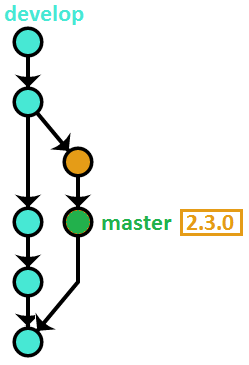

[原文](https://www.endoflineblog.com/oneflow-a-git-branching-model-and-workflow)

# OneFlow – a Git branching model and workflow

Posted on 2017-04-30

この投稿では、私のサイドプロジェクトと仕事の両方で長年成功を収めてきた Git のブランチモデルについて説明します。私はそれを OneFlow と呼びます。

このワークフローは、2015年5月に [GitFlow considered harmful](https://www.endoflineblog.com//gitflow-considered-harmful) の記事で最初に説明しています。
上記投稿のコメントで、このブランチモデルの詳細な説明を求めるリクエストが多く、また、 OneFlow という名前は読者から提案されました（多くの候補から選びました）。
この記事は、包括的かつ詳細なリファレンスとなることを意図していますが、コアのブランチモデルは、上記投稿で説明されているものとまったく同じです。

## Table of Contents

- [Introduction](#introduction)
  - [OneFlow advantages](#oneflow-advantages)
  - [When to use OneFlow](#when-to-use-oneflow)
  - [When NOT to use OneFlow](#when-not-to-use-oneflow)
- [Detailed description](#detailed-description)
  - [The main branch](#the-main-branch)
  - [Feature branches](#feature-branches)
    - [Starting a feature branch](#starting-a-feature-branch)
    - [Finishing a feature branch](#finishing-a-feature-branch)
  - [Release branches](#release-branches)
    - [Starting a release branch](#starting-a-release-branch)
    - [Finishing a release branch](#finishing-a-release-branch)
  - [Hotfix branches](#hotfix-branches)
    - [Starting a hotfix branch](#starting-a-hotfix-branch)
    - [Finishing a hotfix branch](#finishing-a-hotfix-branch)
- [Variation – develop + master](#variation-develop-master)
  - [The main branches](#the-main-branches)
  - [Feature branches](#develop-feature-branches)
    - [Starting a feature branch](#develop-starting-a-feature-branch)
    - [Finishing a feature branch](#develop-finishing-a-feature-branch)
  - [Release branches](#develop-release-branches)
    - [Starting a release branch](#develop-starting-a-release-branch)
    - [Finishing a release branch](#develop-finishing-a-release-branch)
  - [Hotfix branches](#develop-hotfix-branches)
    - [Starting a hotfix branch](#develop-starting-a-hotfix-branch)
    - [Finishing a hotfix branch](#develop-finishing-a-hotfix-branch)

## Introduction

OneFlow は、 [GitFlow](http://nvie.com/posts/a-successful-git-branching-model/) のよりシンプルな代替手段として考えられています。ただし、「シンプル」を「劣っている(less able)」と解釈しないでください。 OneFlow のブランチモデルは、 GitFlow とまったく同じくらい強力です。
There is not a single thing that can be done using GitFlow that can’t be achieved (in a simpler way) with OneFlow. The description below goes into more detail.

名前が示すように、 OneFlow の基本的な前提として、リポジトリに対して1つの永続的なブランチがあることです。これにより、ブランチモデルの表現力を失うことなく、多くの利点がもたらされます。 Git のタグの使用により、より高度なユースケースが実現可能になります。

ワークフローは永続的 (long-lived) なブランチを1つ持つことを提唱していますが、それを使用するときに他のブランチが関与していないという意味ではありません。逆に、このブランチモデルでは、さまざまなサポートブランチの使用を推奨しています（詳細については、以下を参照してください）。
ただし、重要なのはそれらが短命であることを意図しており、その主な目的は、コードの共有を容易にし、バックアップとして機能することです。履歴は常に1つの永続的 (long-lived) なブランチに基づいています。

### OneFlow advantages

永続的 (long-lived) なブランチを1つ維持することで、開発者が実行しなければならないバージョン管理スキームと操作が大幅に簡素化されます。

また、プロジェクトの履歴がすっきりと読みやすくなり、より便利になります。

### When to use OneFlow

OneFlow は、 GitFlow の完全互換 (a drop-in replacement) となることを目的としています。つまり、 GitFlow が存在するすべての状況に適しています。実際、 GitFlow を使用しているプロジェクトを OneFlow に非常に簡単に移行できます。

プロジェクトで OneFlow を使用するために満たす必要がある主な条件は、すべての新しい本番リリースが以前のリリースに基づいていることです (GitFlow の要件はまったく同じです) 。
だいたいのソフトウェアプロジェクトは、その条件を満たしています。たとえば、プロジェクトが Web アプリケーションの場合、 OneFlow が最適です。また、ほとんどのオープンソースプロジェクトは、 OneFlow を使用してバージョン管理することもできます。

### When NOT to use OneFlow

OneFlow はかなり柔軟性がありますが、すべてのプロジェクトに適しているわけではありません。 OneFlow は、 GitFlow と基本的に同じ状況ではうまく適合しません。これが当てはまる理由は主に2つあります。

まず、上記の条件（「すべての新しい製品リリースは以前のリリースに基づく」）が満たされない場合。例として、 [Pythonプログラミング言語](https://www.python.org/) を取り上げます。
2つと3つの非互換バージョンがあります。どちらにもバグ修正とセキュリティパッチが適用されます。ただし、 Python 3 の新しいリリースが Python 2 の最新リリースのコミットに基づいているという意味ではありません。2つのバージョンは分岐しています。そして多くのコードを共有していますが、一方が他方に基づいているとは言えません（純粋にバージョン管理の観点から話しています）。

プロジェクトがその方法で同時に複数の互換性のないリリースバージョンを維持する必要がある場合、 OneFlow は **そのままでは** 機能しません。
しかし機能させることができます。
たとえば、 OneFlow を使用して、各バージョンを管理できます。ただし、これらのタイプのプロジェクトでは、主な課題は通常、バージョン間の相互作用とバージョン間でコードを効果的に共有する方法にあり、OneFlowはその問題の解決策として設計されていません。

次に、プロジェクトにC I/CD など高度な自動化が含まれている場合、このワークフローはおそらく重すぎるでしょう。おそらく一部は役に立つかもしれませんが、リリースプロセスなど他の要素で、頻繁にリリースするときに意味をなすように大幅に変更する必要があります。

## Detailed description

### The main branch

前述したように、ワークフローは1つの永久的なブランチのみを使用します。この名前は重要ではなく、何でもかまいません。この説明では `master` ブランチを使用します。おそらく最も一般的な名前であり、すでに Git の慣例ですが、たとえば、 `current` 、`default` 、 `mainline` などを使用することもできるでしょう。

### Feature branches


フィーチャーブランチ（トピックブランチとも呼ばれます）は、日々の開発作業が行われる場所です。そのため、すべてのサポートブランチの中で最も一般的です。これらは、次のリリースの新機能とバグ修正の開発に使用されます。それらは通常、 `feature/my-feature` のように命名されます。

フィーチャーブランチは多くの場合、開発者のリポジトリにのみ存在し、プッシュされません。ただし、1つのフィーチャーで複数の人が作業している場合、またはフィーチャー開発に長い時間がかかる場合は、リモートリポジトリにプッシュするのが一般的です (if only to make sure the code isn’t lost with a single disk failure) 。

#### Starting a feature branch

フィーチャーブランチを開始するには、 `master` から新しいブランチを作成するだけです：

```bash
$ git checkout -b feature/my-feature master
```

#### Finishing a feature branch

作業が完了したら、それを `master` にマージする必要があります。これを行うにはいくつかの方法があります。

**Note:** フィーチャーフォンブランチのマージ方法は重要ではありません。個人またはチームの好みに基づく必要がありますが、どのマージ方法を選択しても、このブランチモデルはまったく同じように機能します。私の個人的な推奨は、 [Option #1 – rebase](#option-#1---rebase) を使用することです。

##### Option #1 - rebase

この方法は、 Git の `rebase` コマンド ( `-i` オプションつき）を使用して、フィーチャーブランチを `master` にマージします：

```bash
$ git checkout feature/my-feature
$ git rebase -i master
$ git checkout master
$ git merge --ff-only feature/my-feature
$ git push origin master
$ git branch -d feature/my-feature
```

もし `rebase` コマンドに慣れていない場合は、 Pro Git SCM book の[この章](https://git-scm.com/book/en/v2/Git-Tools-Rewriting-History)をお勧めします。

以下は、その方法がどのように機能するかをビジュアライズしたもので：


この方法の利点：

- `master` にマージする前にリベースすると、ブランチの履歴を公開する前にきれいにできるため、最終的な履歴がよりよくなります
- Linear history を使用すると、特にファイルごとの履歴を見るときに、物事をより簡単に見つけることができます

欠点：

- フィーチャー全体をリバートするには、複数のコミットをリバートする必要があります

##### Option #2 – merge –no-ff

これは GitFlow が推奨する方法です。

```bash
$ git checkout master
$ git merge --no-ff feature/my-feature
$ git push origin master
$ git branch -d feature/my-feature
```

図：


この方法の利点：

- フィーチャー全体をリバートするには、1つのコミット（マージコミット）のみをリバートするだけ

欠点：

- 履歴のきれいではないフィーチャーフォンブランチの履歴は、 `master` にそのまま反映される
- マージコミットが急増すると、履歴が管理できなくなります（特にプロジェクトの開発者の数が増えるにつれて）

##### Option #3 – rebase + merge –no–ff

この方法は、前の2つを組み合わせて、それらの利点を維持しつつ、同時に欠点を取り除きます：

```bash
$ git checkout feature/my-feature
$ git rebase -i master
$ git checkout master
$ git merge --no-ff feature/my-feature
$ git push origin master
$ git branch -d feature/my-feature
```

図：


この方法の利点：

- クリーンでほぼ線形の履歴
- 1回のコミットでフィーチャー全体を簡単にリバートすることができます

欠点：

- この方法をプログラムで強制することは難しいため、ベストエフォートの規則に依存する必要があります

最後に、使用するマージ方法に関係なく、フィーチャーブランチがリモートリポジトリにプッシュされた場合は、それを削除する必要があります。

```bash
$ git push origin :feature/my-feature
```

### Release branches

リリースブランチはソフトウェアをリリースする準備をするために作成されます。もちろん、それが正確に何を意味するかは、プロジェクトごとに異なります。
これは、コンフィグレーションのバージョンナンバーを上げるだけの単純なものでもいいですし、コードのフリーズ、 Release Candidate の作成、完全な QA プロセスのようなものでもかまいません。重要なことは、すべて別のブランチで行われるということで、日々の開発を通常どおり `master` で続行できます。

これらの命名規則は `release/<version-number>` です。

#### Starting a release branch

リリースブランチも `master` から開始しますが、多くの場合は tip から開始するのではなく、 `master` 上のコミットの中で、そのリリースに含めたい機能がすべて含まれていると思われるコミットから開始します。

例えば、ここではバージョン `2.3.0` リリースのブランチを `9efc5d` のコミットハッシュから開始しています：

```bash
$ git checkout -b release/2.3.0 9efc5d
```

#### Finishing a release branch

リリースに使用するプロセスがすべて完了すると、ブランチの tip にバージョン番号のタグが付けられます。その後、ブランチを `master` にマージして、永続的にバージョン管理する必要があります：

```bash
$ git checkout release/2.3.0
$ git tag 2.3.0
$ git checkout master
$ git merge release/2.3.0
$ git push --tags origin master
$ git branch -d release/2.3.0
```

上記のコマンドを示す図は次のとおりです（リリースで2つのコミットが行われたと想定しています）：


繰り返しになりますが、リリースブランチをリモートリポジトリにプッシュした場合は、ここでブランチを削除する必要があります：

```bash
$ git push origin :release/2.3.0
```

### Hotfix branches

Hotfix branches are very similar to release branches – they result in a new version of the project being released. Where they differ is their intentions – while release branches signify a planned production milestone, hotfix branches are most often an unwanted but necessary exception to the usual release cadence, typically because of some critical defect found in the latest release that needs to be fixed as soon as possible.

Hotfix ブランチはリリースブランチと非常によく似ており、プロジェクトの新しいバージョンがリリースされます。それらが異なるのは意図的です。リリースブランチは計画されたマイルストーンを示しますが、 Hotfix ブランチは通常のリリースケイデンスに対して望ましくないが必要な例外です。通常、最新のリリースで重大なバグが見つかり、すぐに修正する必要がある場合などに利用されます。

それらは `hotfix/<version-number>` という名前です。 [セマンティックバージョニング](http://semver.org/) を使用する場合、通常のリリースではメジャーバージョンまたはマイナーバージョンのいずれかがバンプされ、 Hotfix ではパッチバージョンがバンプされます。

#### Starting a hotfix branch

Hotfix ブランチは、最新バージョンのタグが指すコミットから作られます。リリースブランチからの例：

```bash
$ git checkout -b hotfix/2.3.1 2.3.0
```

#### Finishing a hotfix branch

Finishing a hotfix branch is pretty much the same as finishing a release branch: tag the tip, merge it to master, then delete the branch.

```bash
$ git checkout hotfix/2.3.1
$ git tag 2.3.1
$ git checkout master
$ git merge hotfix/2.3.1
$ git push --tags origin master
$ git branch -d hotfix/2.3.1
```

図：


Hotfix ブランチを終了する場合、1つの特別なケースがあります。 Hotfix が完了する前に次のリリースに備えてリリースブランチが既にカットされている場合、 Hotfix ブランチを `master` ではなくリリースブランチにマージする必要があります。それ以外の場合、新しいリリースでは、 Hotfix によって修正された元のバグが返されます。リリースブランチがマージされたときに修正は最終的に `master` にマージされます。

As always, if the hotfix branch was pushed to the central repository, you need to remove it now:
いつものように、 Hotfix ブランチがリモートリポジトリにプッシュされた場合は、ここで削除する必要があります。

```bash
$ git push origin :hotfix/2.3.1
```

## Variation – develop + master

上記のブランチモデルには1つの小さな問題があります。最新の Production バージョンのコードを見つけるためには、リポジトリ内のすべてのタグを確認し、最新のタグをチェックアウトする必要があります。

この問題は非常に単純な解決策をあります。最後にリリースされたコミットを指し示すことのみを目的とする別の存続期間の長い「最新」ブランチを追加します。バージョンが上がるたびに、「最新」のブランチが新しく作成されたタグに fast-forwarded されます。

これは素晴らしいことですが、一つだけ小さな問題が残っています。特にオープンソースプロジェクトの場合、リポジトリをクローンするときにデフォルトブランチがこの「最新」のブランチになっていて、安定したコードが含まれているのではなく、「working」（上記の説明では `master` と呼ばれている）ブランチにはまだリリースされていない次のバージョンの進行中の作業が含まれていて、あまり安定していないかもしれないのです

この問題の最も単純な解決策は、 `master` が Git のデフォルトブランチであるという事実を利用することです。つまり、「最新」のブランチを `master` と呼ぶことです。
しかし、これでは「working」ブランチの新しい名前を見つけなければなりません。この説明では、 GitFlow の規約を利用して `develop` と呼ぶことにします (もちろん、プロジェクト内での呼び方は自由です)。

わかりやすいように、今回はこれらの新しい名前を使用して、ワークフローの操作を再度説明します。ただし、若干の名前の変更と新しい「marker」ブランチの導入を除けば、ワークフローは上記と全く同じであることを強調しておきます。

### The main branches

このバリエーションでは、2つのブランチを使用します。上の `master` と同じ役割を果たす `develop` と、最新のリリースタグを指す `master` です。

### Feature branches

フィーチャーブランチの動作は、上の説明で `master` を `develop` に置き換える必要があることを除けば、すでに説明したものとまったく同じです。

#### Starting a feature branch

```bash
$ git checkout -b feature/my-feature develop
```

#### Finishing a feature branch

##### Option #1 – rebase

```bash
$ git checkout feature/my-feature
$ git rebase -i develop
$ git checkout develop
$ git merge --ff-only feature/my-feature
$ git push origin develop
$ git branch -d feature/my-feature
```

##### Option #2 – merge –no-ff

```bash
$ git checkout develop
$ git merge --no-ff feature/my-feature
$ git push origin develop
$ git branch -d feature/my-feature
```

##### Option #3 – rebase + merge –no–ff

```bash
$ git checkout feature/my-feature
$ git rebase -i develop
$ git checkout develop
$ git merge --no-ff feature/my-feature
$ git push origin develop
$ git branch -d feature/my-feature
```

### Release branches

リリースブランチは上で説明したのと同じように動作します（`master` を `develop` に置き換えています）。リリースブランチを終了する際には、「marker」ブランチを新しく作成されたリリースタグに fast-forwarding するという追加のステップがあります。

#### Starting a release branch

```bash
$ git checkout -b release/2.3.0 9efc5d
```

#### Finishing a release branch

```bash
$ git checkout release/2.3.0
$ git tag 2.3.0
$ git checkout develop
$ git merge release/2.3.0
$ git push --tags origin develop
$ git branch -d release/2.3.0
```

そして、ここに追加のステップがあります - `master` を最新のリリースタグに fast-forwarding します：

```bash
$ git checkout master
$ git merge --ff-only 2.3.0
```

リリースブランチを終えた後のリポジトリの状態を可視化したものがこちらです：



### Hotfix branches

Hotfix のブランチでは、新しいバージョンも公開されるため、`master` を新しく作成されたタグに fast-forwarding するという追加のステップも必要になります。

#### Starting a hotfix branch

`master` は常に最新のタグをトラックするので、このバージョンでは Hotfix ブランチの作成が少しだけ簡単になりました（ただし、 Hotfix ブランチの名前を正しく付けるためには、タグを見て前のバージョン番号を確認する必要があります)：

```bash
$ git checkout -b hotfix/2.3.1 master
```

#### Finishing a hotfix branch

```bash
$ git checkout hotfix/2.3.1
$ git tag 2.3.1
$ git checkout develop
$ git merge hotfix/2.3.1
$ git push --tags origin develop
$ git branch -d hotfix/2.3.1
```

そして、ここに `master` を最新のリリースタグに fast-forwarding する追加のステップがあります。

```bash
$ git checkout master
$ git merge --ff-only 2.3.1
```

図はこのようになります。


## Summary

これが OneFlow の簡単な説明です。ワークフローについてわからないことがあったり、説明で不明な点があれば、下のコメント欄で教えてください。出来る限りお答えします。

I also wanted to ask you, dear reader, one thing. GitFlow has a [set of command-line tools that help with managing the workflow](https://github.com/nvie/gitflow). Personally, I’m not a huge fan of that, as I think relying on the tools makes people never learn the actual concepts behind the workflow they’re using, and when things go wrong (which they seem to invariably do with these tools – for example, if you happen to execute the commands in the wrong order), they have no idea how to fix it, and wind up with their repository in a really weird state. However, I also recognize that these tools help with the adoption of the workflow, and are useful when, for example, trying to enforce team-wide standards.

So, here’s my question to you: do you want to see a similar command-line tool for working with OneFlow? If the answer is ‘yes’, please let me know in the comments. If enough people express interest in using a project like that, then I’ll devote some time to creating that tool.

Credits: the diagrams used in this article were created using the awesome [GitGraph.js](http://gitgraphjs.com/) library.
